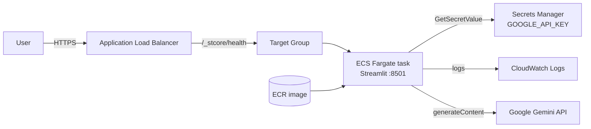

# Terraform — AWS infrastructure (ECS Fargate + ALB)

Infrastructure-as-Code for the Medical Imaging Diagnosis Agent. It codifies a
production-shaped AWS deployment so the architecture is reviewable **without spending
anything** — resources are only created when you run `terraform apply`, and removed
by `terraform destroy`.

## Architecture



| Resource | Purpose |
|----------|---------|
| ECR repository | Stores the container image |
| ECS cluster + Fargate service/task | Runs the container, serverless (no EC2 to manage) |
| Application Load Balancer + target group | Public entry point, health checks `/_stcore/health` |
| Secrets Manager | Holds `GOOGLE_API_KEY`, injected at runtime (never in the image) |
| IAM execution role | Least privilege: pull image + read *only* this secret |
| Security groups | Public 80 → ALB; ALB → task on 8501 only |
| CloudWatch Logs | Centralised application logs |

## Usage

```bash
cd deploy/terraform
terraform init

# 1. Create the ECR repo (and everything else). Provide your key out-of-band:
export TF_VAR_google_api_key=AQ...your_key
terraform apply -target=aws_ecr_repository.app     # create the repo first

# 2. Build & push the image (from repo root)
ECR=$(terraform -chdir=deploy/terraform output -raw ecr_repository_url)
aws ecr get-login-password --region eu-west-3 | docker login --username AWS --password-stdin "${ECR%/*}"
docker build --platform linux/amd64 -t "$ECR:latest" ../..
docker push "$ECR:latest"

# 3. Create the rest of the stack
terraform apply

terraform output app_url    # -> http://<alb>.eu-west-3.elb.amazonaws.com
```

Tear everything down (back to $0):

```bash
terraform destroy
```

## Cost note

`terraform apply` provisions billable resources (Fargate task ~running cost + ALB).
For a **zero-cost portfolio**, keep this as reviewable IaC and don't apply — or apply,
capture a screenshot/GIF for your portfolio, then `terraform destroy` (cost: a few cents
for the minutes it ran). HTTPS with a custom domain would add an ACM certificate + a
listener on 443 (free certificate; the ALB is the only fixed cost).

> This module intentionally builds the full stack by hand (cluster, task, ALB, target
> group, security groups, IAM, logs) rather than a managed abstraction, to make the
> cloud architecture explicit.
